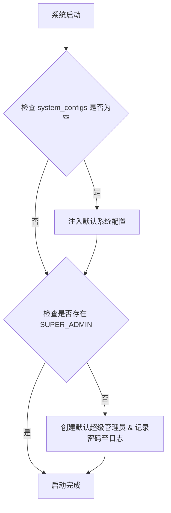
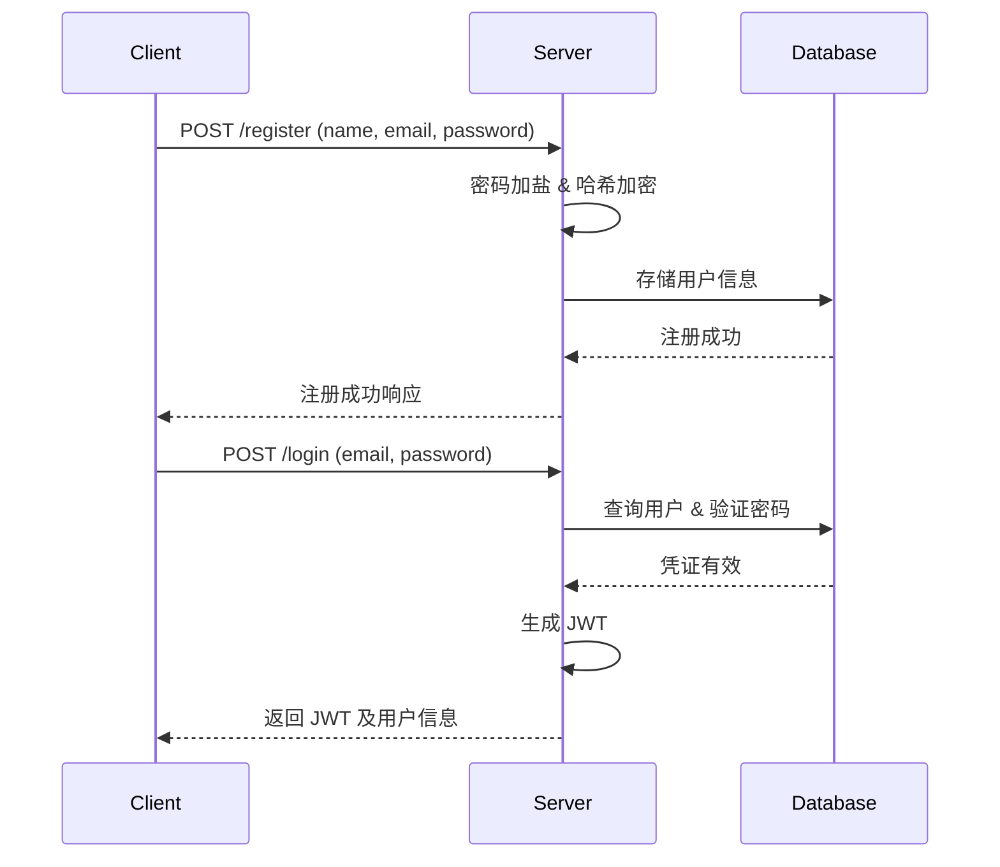
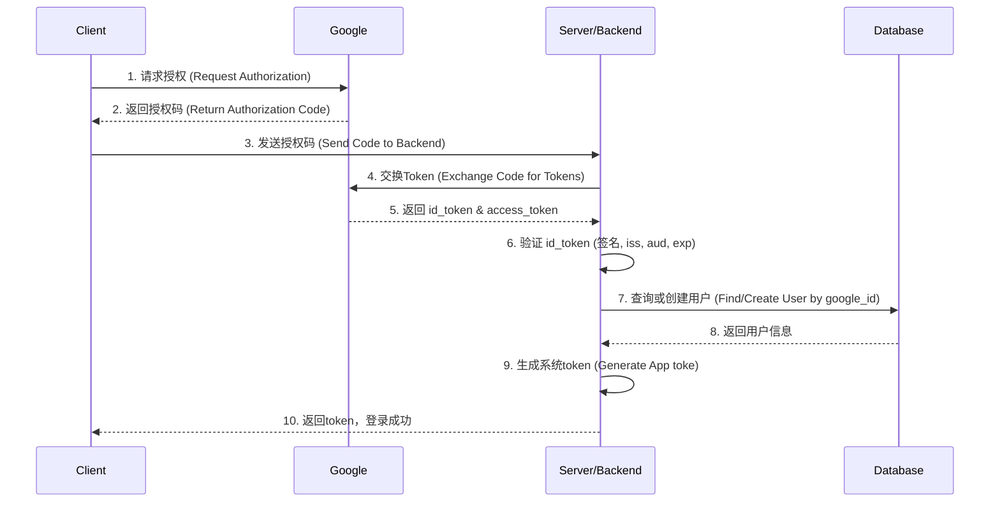
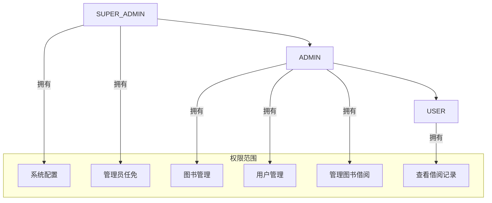
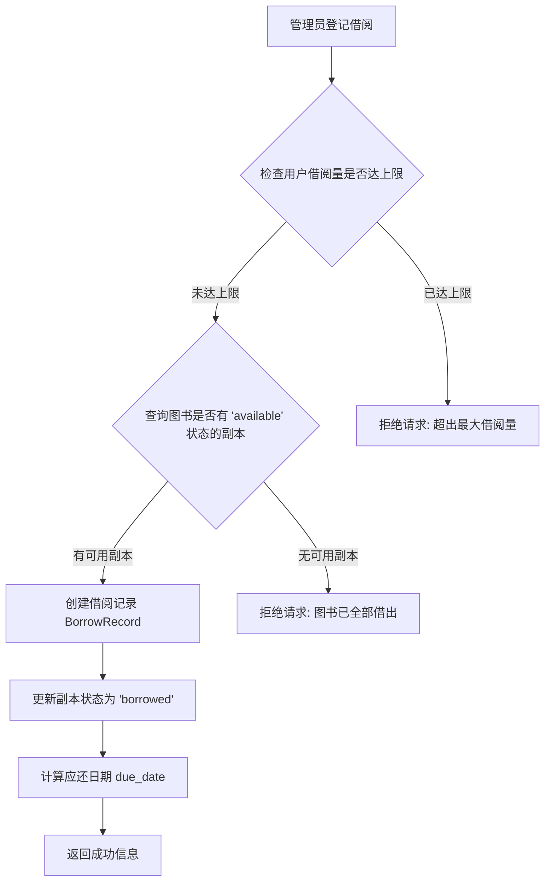
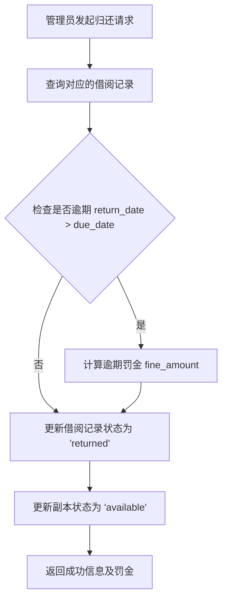
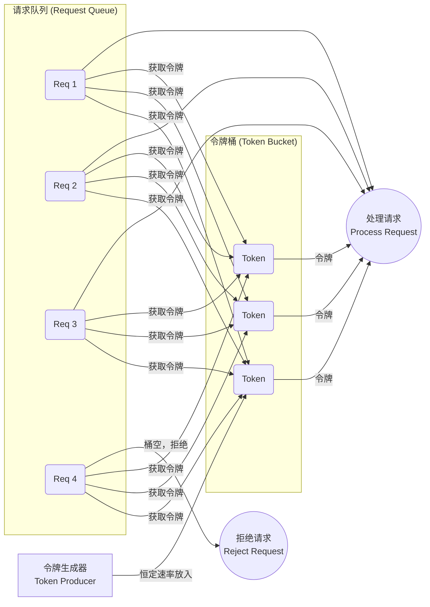
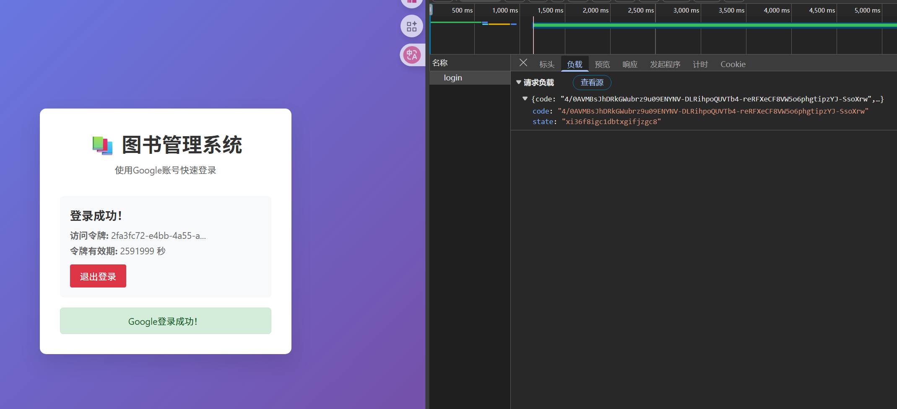
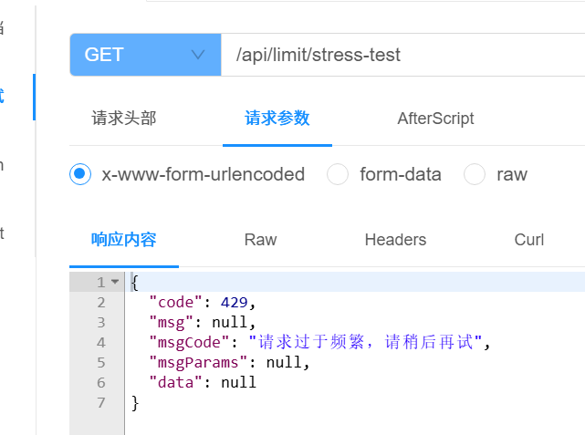

# 图书管理系统


## 系统亮点

### 🔐 多重安全认证体系设计
1. **双重认证机制集成**：实现邮箱/密码认证与Google OAuth 2.0认证的无缝集成，支持用户多样化登录需求
   - **前端安全传输**：采用RSA非对称加密算法对客户端传输密码进行加密，防止网络传输过程中的密码泄露
   - **后端安全存储**：使用随机盐值结合MD5哈希算法对用户密码进行不可逆加密存储
   - **OAuth2.0标准实现**：严格按照RFC 6749标准实现授权码模式，包含ID Token验证、签名校验等安全措施

2. **基于Sa-Token的JWT会话管理**：集成Sa-Token框架实现无状态认证，支持Redis缓存优化，提升认证效率

### 🏗️ 企业级权限管理架构
1. **RBAC权限模型设计**：基于角色的访问控制系统，实现USER → ADMIN → SUPER_ADMIN三级权限继承体系
   - **AOP切面权限控制**：通过自定义`@RequireRole`注解结合AOP实现方法级权限拦截
   - **细粒度权限划分**：从接口访问到数据查看，实现资源级别的精确权限控制
   - **动态权限验证**：支持运行时权限检查，无需重启服务即可调整权限策略

### ⚡ 高性能系统设计
1. **API限流防护机制**：基于令牌桶算法（Token Bucket）实现接口级限流保护
   - **自定义限流注解**：开发`@RateLimit`注解，支持配置化的限流策略
   - **分布式限流支持**：结合Redis实现集群环境下的统一限流控制
   - **优雅降级处理**：超限请求返回标准HTTP 429状态码，保证系统稳定性

2. **数据库性能优化**：
   - **逻辑删除设计**：全表采用软删除机制，保证数据完整性和业务回溯能力
   - **索引优化策略**：合理设计唯一索引和复合索引，优化查询性能
   - **MyBatis-Plus集成**：利用代码生成器和条件构造器，提升开发效率

### 🔄 系统自举与配置管理
1. **智能系统初始化**：实现SpringBoot启动时的自举机制
   - **默认配置注入**：系统首次启动自动初始化必要的系统参数配置
   - **超级管理员自动创建**：检测并创建默认管理员账户，确保系统可管理性
   - **安全密码生成**：采用强随机算法生成初始密码，强制首次登录修改

2. **动态配置管理**：基于数据库的配置中心设计，支持系统参数的热更新，无需重启服务

### 🎯 业务逻辑复杂度处理
8. **图书生命周期管理**：
   - **级联删除保护**：实现图书删除前的依赖检查，防止数据不一致
   - **状态机设计**：图书副本和借阅记录采用严格的状态转换机制
   - **并发安全控制**：处理多用户同时借阅同一图书的并发场景

9. **RESTful API标准化**：
   - **统一响应格式**：自定义Response包装器，标准化API返回结构
   - **全局异常处理**：基于`@ControllerAdvice`实现统一异常捕获和处理
   - **请求参数验证**：结合Bean Validation进行请求参数校验

### 📊 系统监控与日志
10. **操作审计日志**：完整记录用户操作轨迹，包括IP地址、用户代理、请求参数等详细信息
11. **性能监控集成**：记录接口执行时间，支持性能瓶颈分析和优化

### 💻 技术栈整合能力
- **后端技术栈**：Spring Boot + MyBatis-Plus + MySQL + Redis + Sa-Token
- **安全技术**：RSA加密 + MD5加盐  + OAuth2.0 + RBAC权限模型
- **系统设计**：微服务设计思想 + AOP切面编程 + 设计模式应用
- **部署运维**：Maven构建 + 配置文件分环境管理

## 需求分析

#### 一、实体分析

| 实体               | 属性                                                                            | 关系说明                |
|------------------|-------------------------------------------------------------------------------|---------------------|
| **User**         | `id, name, email, google_id, password_hash, role(enum)`, join_date, is_active | 支持Google OAuth和邮箱登录 |
| **Admin**        | 继承自User实体，额外属性：`admin_level(enum)`                                            | 管理员分为超级管理员和普通管理员    |
| **Book**         | `isbn, title, publisher, publish_year`                                        | 核心书目元数据             |
| **BookCopy**     | `copy_id, book_isbn(FK), status(enum)`, location                              | 物理副本管理              |
| **Author**       | `id, name, bio, user_id(FK)`                                                  | 作者实体（可关联用户）         |
| **BorrowRecord** | `id, user_id(FK), copy_id(FK)`, borrow_date, due_date, return_date            | 借阅生命周期管理            |

**关键关系说明**：

1. 书-作者多对多：通过`book_author`关联表实现
   
   - 图书删除时自动解除关联

2. 作者-用户可选绑定：
   
   ```
   erDiagram
      USER ||--o{ AUTHOR : "可选关联"
      USER {
          string id PK
          string google_id
      }
      AUTHOR {
          string id PK
          string user_id FK "nullable"
      }
   ```

---

#### 二、功能需求

##### 用户模块（User）

| 功能     | 描述                  | 权限                 |
|--------|---------------------|--------------------|
| 谷歌凭证登录 | 通过Google OAuth2.0实现 | 公开                 |
| 邮箱注册登录 | 使用邮箱和密码注册/登录        | 公开                 |
| 查看借阅记录 | 显示当前/历史借阅及归还状态      | 自身  (作者看到自己书的所有记录) |
| 修改个人信息 | 更新姓名、邮箱等基本信息        | 自身                 |

##### 图书管理模块

| 功能     | 描述              | 权限         |
|--------|-----------------|------------|
| 添加新书   | 创建书目+初始副本（最少1本） | Admin      |
| 编辑图书详情 | 修改元数据（ISBN不可修改） | Admin      |
| 删除图书   | 需检查无借出副本才允许删除   | Admin      |
| 借阅图书   | 选择在馆副本生成借阅记录    | User       |
| 归还图书   | 更新副本状态+借阅记录     | User/Admin |

##### 管理员专属功能（Admin）

**普通管理员（ADMIN）**：

- **用户管理**：冻结/解冻普通用户账户
- **副本管理**：新增/报废图书副本
- **借阅监督**：查看所有借阅记录
- **系统维护**：配置借阅规则（借期）

**超级管理员（SUPER_ADMIN）**：

- 包含普通管理员的所有权限
- **权限管理**：提升普通用户为管理员，降级普通管理员
- **管理员管理**：冻结/解冻管理员账户
- **系统配置**：修改系统级别配置参数

---

#### 三、权限矩阵

| 操作         | User | Admin | Super Admin |
|------------|------|-------|-------------|
| 查看自身借阅记录   | ✔    | ✔     | ✔           |
| 借阅可用图书     | ✘    | ✔     | ✔           |
| 创建/编辑/删除图书 | ✘    | ✔     | ✔           |
| 归还他人借阅的图书  | ✘    | ✔     | ✔           |
| 查看所有用户借阅历史 | ✘    | ✔     | ✔           |
| 管理普通用户账户状态 | ✘    | ✔     | ✔           |
| 管理管理员账户状态  | ✘    | ✘     | ✔           |
| 提升/降级用户权限  | ✘    | ✘     | ✔           |
| 系统级别配置     | ✘    | ✘     | ✔           |

---

#### 四、核心流程规范

1. **图书删除保护机制**：
   
   ```
   graph TD
      A[删除图书] --> B{检查副本状态}
      B -->|存在借出副本| C[终止操作并告警]
      B -->|全部在馆| D[解除作者关联]
      D --> E[删除所有副本]
      E --> F[删除书目]
   ```

2. **借阅生命周期**：
   
   - 借出：副本状态 → `BORROWED`
   - 归还：副本状态 → `AVAILABLE`
   - 超期：借阅记录标记`OVERDUE`（不阻塞归还）

3. **作者管理原则**：
   
   - 作者删除：当图书仍关联时禁止删除
   - 用户绑定：当作者关联用户时，需用户解绑才能删除

---

#### 五、特殊设计说明

1. **多种登录方式**：
   
   **谷歌登录集成**：
   
   ```
   用户流程：
   1. 前端调用Google OAuth
   2. 后端验证ID Token
   3. 系统自动注册/登录（存储google_id）
   4. 首次登录时提示补充姓名信息
   ```
   
   **邮箱注册登录**：
   
   ```
   注册流程：
   1. 用户输入邮箱、密码、姓名
   2. 系统验证邮箱格式和密码强度
   3. 发送邮箱验证码
   4. 用户验证邮箱后完成注册
   
   登录流程：
   1. 用户输入邮箱和密码
   2. 系统验证凭证
   3. 生成JWT Token完成登录
   ```

2. **实体操作边界**：
   
   - 普通用户：仅能操作自身数据
   - 普通管理员：具有图书和用户管理权限
   - 超级管理员：具有全局编辑权限，包括管理员权限管理
   - 作者实体：独立维护不影响用户系统

3. **系统初始化**：
   
   ```
   系统启动时的初始化流程：
   1. 检查是否存在超级管理员账户
   2. 如不存在，创建默认超级管理员账户
   3. 默认账户：admin@system.com / 系统生成密码
   4. 首次登录强制修改密码
   ```

## 数据库设计

### 数据库基本信息

- **数据库名称**：`book_manger`
- **字符集**：UTF8MB4
- **排序规则**：utf8mb4_unicode_ci
- **存储引擎**：InnoDB
- **建表语句**：[sql/schema.sql](sql/schema.sql)

### 数据表结构

#### 核心业务表

##### 1. 用户表 (users)

存储系统用户信息，支持Google OAuth和邮箱登录。

| 字段名         | 类型           | 约束                                                              | 说明              |
|-------------|--------------|-----------------------------------------------------------------|-----------------|
| id          | BIGINT       | PRIMARY KEY, AUTO_INCREMENT                                     | 用户ID            |
| name        | VARCHAR(100) | NOT NULL                                                        | 用户姓名            |
| email       | VARCHAR(255) | NOT NULL, UNIQUE                                                | 邮箱地址            |
| google_id   | VARCHAR(255) | UNIQUE                                                          | Google OAuth ID |
| password    | VARCHAR(255) | NULL                                                            | 密码              |
| role        | VARCHAR(64)  | NOT NULL, DEFAULT 'user'                                        | 用户角色            |
| admin_level | VARCHAR(64)  | NULL                                                            | 管理员级别           |
| join_date   | DATETIME     | NOT NULL, DEFAULT CURRENT_TIMESTAMP                             | 注册时间            |
| is_active   | TINYINT(1)   | NOT NULL, DEFAULT 1                                             | 账户状态            |
| create_time | DATETIME     | NOT NULL, DEFAULT CURRENT_TIMESTAMP                             | 创建时间            |
| update_time | DATETIME     | NOT NULL, DEFAULT CURRENT_TIMESTAMP ON UPDATE CURRENT_TIMESTAMP | 更新时间            |

**索引**：

- `uk_email`：邮箱唯一索引
- `uk_google_id`：Google ID唯一索引

##### 2. 图书表 (books)

存储图书基本信息，以ISBN为主键。

| 字段名          | 类型           | 约束                                                              | 说明            |
|--------------|--------------|-----------------------------------------------------------------|---------------|
| id          | BIGINT       | PRIMARY KEY                                     | 用户ID            |
| isbn         | VARCHAR(20)  |       NOT NULL                                               | ISBN码（国际标准书号） |
| title        | VARCHAR(500) | NOT NULL                                                        | 书名            |
| publisher    | VARCHAR(200) | NOT NULL                                                        | 出版社           |
| publish_year | YEAR         | NOT NULL                                                        | 出版年份          |
| description  | TEXT         | NULL                                                            | 图书描述          |
| create_time  | DATETIME     | NOT NULL, DEFAULT CURRENT_TIMESTAMP                             | 创建时间          |
| update_time  | DATETIME     | NOT NULL, DEFAULT CURRENT_TIMESTAMP ON UPDATE CURRENT_TIMESTAMP | 更新时间          |
| deleted      | TINYINT(1)   | NOT NULL, DEFAULT 0                                             | 逻辑删除标志        |

##### 3. 作者表 (authors)

存储作者信息，支持与用户关联。

| 字段名         | 类型           | 约束                                                              | 说明         |
|-------------|--------------|-----------------------------------------------------------------|------------|
| id          | BIGINT       | PRIMARY KEY, AUTO_INCREMENT                                     | 作者ID       |
| name        | VARCHAR(100) | NOT NULL                                                        | 作者姓名       |
| bio         | TEXT         | NULL                                                            | 作者简介       |
| user_id     | BIGINT       | NULL                                                            | 关联用户ID（可选） |
| birth_date  | DATE         | NULL                                                            | 出生日期       |
| nationality | VARCHAR(100) | NULL                                                            | 国籍         |
| create_time | DATETIME     | NOT NULL, DEFAULT CURRENT_TIMESTAMP                             | 创建时间       |
| update_time | DATETIME     | NOT NULL, DEFAULT CURRENT_TIMESTAMP ON UPDATE CURRENT_TIMESTAMP | 更新时间       |
| deleted     | TINYINT(1)   | NOT NULL, DEFAULT 0                                             | 逻辑删除标志     |

##### 4. 图书副本表 (book_copies)

存储图书的物理副本信息。

| 字段名             | 类型           | 约束                                                              | 说明     |
|-----------------|--------------|-----------------------------------------------------------------|--------|
| copy_id         | BIGINT       | PRIMARY KEY, AUTO_INCREMENT                                     | 副本ID   |
| book_isbn       | VARCHAR(20)  | NOT NULL                                                        | 图书ISBN |
| status          | VARCHAR(20)  | NOT NULL, DEFAULT 'available'                                   | 副本状态   |
| location        | VARCHAR(200) | NULL                                                            | 存放位置   |
| condition_notes | TEXT         | NULL                                                            | 状态备注   |
| create_time     | DATETIME     | NOT NULL, DEFAULT CURRENT_TIMESTAMP                             | 创建时间   |
| update_time     | DATETIME     | NOT NULL, DEFAULT CURRENT_TIMESTAMP ON UPDATE CURRENT_TIMESTAMP | 更新时间   |
| deleted         | TINYINT(1)   | NOT NULL, DEFAULT 0                                             | 逻辑删除标志 |

**副本状态枚举**：

- `available`：可借阅
- `borrowed`：已借出

##### 5. 借阅记录表 (borrow_records)

存储图书借阅的完整生命周期。

| 字段名           | 类型            | 约束                                                              | 说明     |
|---------------|---------------|-----------------------------------------------------------------|--------|
| id            | BIGINT        | PRIMARY KEY, AUTO_INCREMENT                                     | 借阅记录ID |
| user_id       | BIGINT        | NOT NULL                                                        | 借阅用户ID |
| copy_id       | BIGINT        | NOT NULL                                                        | 图书副本ID |
| borrow_date   | DATETIME      | NOT NULL, DEFAULT CURRENT_TIMESTAMP                             | 借阅时间   |
| due_date      | DATETIME      | NOT NULL                                                        | 应还时间   |
| return_date   | DATETIME      | NULL                                                            | 实际归还时间 |
| status        | VARCHAR(20)   | NOT NULL, DEFAULT 'active'                                      | 借阅状态   |
| renewal_count | INT           | NOT NULL, DEFAULT 0                                             | 续借次数   |
| fine_amount   | DECIMAL(10,2) | NOT NULL, DEFAULT 0.00                                          | 罚金金额   |
| notes         | TEXT          | NULL                                                            | 备注信息   |
| create_time   | DATETIME      | NOT NULL, DEFAULT CURRENT_TIMESTAMP                             | 创建时间   |
| update_time   | DATETIME      | NOT NULL, DEFAULT CURRENT_TIMESTAMP ON UPDATE CURRENT_TIMESTAMP | 更新时间   |
| deleted       | TINYINT(1)    | NOT NULL, DEFAULT 0                                             | 逻辑删除标志 |

**借阅状态枚举**：

- `active`：借阅中
- `returned`：已归还
- `overdue`：逾期

#### 系统表

##### 6. 系统配置表 (system_configs)

存储系统级别配置参数。

| 字段名          | 类型           | 约束                                                              | 说明   |
|--------------|--------------|-----------------------------------------------------------------|------|
| id           | BIGINT       | PRIMARY KEY, AUTO_INCREMENT                                     | 配置ID |
| config_key   | VARCHAR(100) | NOT NULL, UNIQUE                                                | 配置键  |
| config_value | VARCHAR(255) | NOT NULL                                                        | 配置值  |
| config_type  | VARCHAR(20)  | NOT NULL, DEFAULT 'STRING'                                      | 配置类型 |
| description  | VARCHAR(500) | NULL                                                            | 配置描述 |
| create_time  | DATETIME     | NOT NULL, DEFAULT CURRENT_TIMESTAMP                             | 创建时间 |
| update_time  | DATETIME     | NOT NULL, DEFAULT CURRENT_TIMESTAMP ON UPDATE CURRENT_TIMESTAMP | 更新时间 |
| is_enabled   | TINYINT(1)   | NOT NULL, DEFAULT 1                                             | 是否开启 |

**配置类型枚举**：

- `STRING`：字符串类型
- `NUMBER`：数值类型
- `BOOLEAN`：布尔类型

##### 7. 操作日志表 (operation_logs)

记录系统关键操作的审计日志。

| 字段名             | 类型           | 约束                                  | 说明       |
|-----------------|--------------|-------------------------------------|----------|
| id              | BIGINT       | PRIMARY KEY, AUTO_INCREMENT         | 日志ID     |
| user_id         | BIGINT       | NULL                                | 操作用户ID   |
| operation_type  | VARCHAR(50)  | NOT NULL                            | 操作类型     |
| operation_desc  | VARCHAR(500) | NOT NULL                            | 操作描述     |
| target_type     | VARCHAR(50)  | NULL                                | 目标类型     |
| target_id       | VARCHAR(100) | NULL                                | 目标ID     |
| ip_address      | VARCHAR(45)  | NULL                                | IP地址     |
| user_agent      | VARCHAR(500) | NULL                                | 用户代理     |
| request_params  | TEXT         | NULL                                | 请求参数     |
| response_result | TEXT         | NULL                                | 响应结果     |
| execution_time  | INT          | NULL                                | 执行时间(ms) |
| create_time     | DATETIME     | NOT NULL, DEFAULT CURRENT_TIMESTAMP | 创建时间     |

### 数据库设计特点

#### 1. 逻辑删除机制

所有业务表都采用逻辑删除设计，通过`deleted`字段标记删除状态，避免物理删除导致的数据丢失。


#### 2. 时间戳追踪

所有表都包含`create_time`和`update_time`字段，自动追踪数据的创建和更新时间。

## 设计方案

### 一、 系统初始化与自举流程

系统在首次启动或关键配置缺失时，将执行自举程序，以确保核心功能的可用性。

#### 1. 默认系统配置注入

启动时，系统将检测 `system_configs` 表。若该表为空，则注入一套基础配置参数，作为系统的默认行为准则。

- **`borrow_duration_days`**: 30 (默认借阅周期)
- **`max_borrow_count`**: 5 (单用户最大可借阅册数)
- **`max_renewal_count`**: 2 (单册图书最大续借次数)
- **`overdue_fine_per_day`**: 0.5 (逾期每日罚金，单位：元)
- **`system_name`**: "图书管理系统"
- **`system_version`**: "1.0.0"

#### 2. 超级管理员账户创建

为保证系统可管理，启动时会检查是否存在角色为 `SUPER_ADMIN` 的用户。若不存在，系统将自动创建一名默认的超级管理员。

- **账户邮箱**: `admin@system.com`
- **账户密码**: 采用强随机算法生成，并输出至系统启动日志中。
- **安全策略**: 该账户在首次登录时，系统将强制要求其修改初始密码，以保障账户安全。

#### 初始化流程图



### 二、 用户认证与授权体系

系统提供基于邮箱/密码和Google OAuth 2.0两种认证方式，并采用JWT（JSON Web Token）进行会话管理。底层集成 `Sa-Token` 框架实现统一的权限控制。

#### 1. 邮箱与密码认证流程

此为系统的标准认证模式。

- **注册**：用户提供姓名、邮箱和密码。后端对密码加盐（Salt）后，使用`MD5`或其他安全的哈希算法进行加密存储。
- **登录**：用户提交邮箱和密码，后端进行凭证校验。成功后，生成包含用户ID、角色等信息的JWT，并返回给客户端。
- **会话维持**：客户端在后续请求的`Authorization`头中携带`Bearer <JWT>`，后端通过`Sa-Token`中间件解析并验证JWT，实现无状态认证和接口权限校验。用户信息可缓存于Redis等高速缓存中，以提升验证效率。

##### 流程图


#### 2. Google OAuth 2.0 认证流程

为了提供便捷登录选项，系统集成了Google的OAuth 2.0认证服务。该流程遵循标准的授权码模式（Authorization Code Flow）。

- **步骤1：前端发起授权请求**
  用户在客户端点击“Google登录”按钮。客户端将用户重定向至Google的OAuth 2.0授权端点，并携带客户端ID、回调URI (`redirect_uri`)、所需权限范围 (`scope`)等参数。

- **步骤2：用户授权**
  用户在Google登录并同意授权。Google服务器将用户重定向回应用指定的`redirect_uri`，并在URL中附带一个一次性的授权码(`authorization_code`)。

- **步骤3：后端交换凭证**
  客户端将获取到的`authorization_code`发送至后端API。

- **步骤4：获取并验证令牌**
  后端服务收到授权码后，向Google的Token端点发起请求，用授权码、客户端ID和客户端密钥交换`access_token`和`id_token`。后端必须严格验证`id_token`的签名、颁发者(`iss`)、受众(`aud`)和有效期(`exp`)，确保其合法性。

- **步骤5：用户同步与登录**
  从验证通过的`id_token`中解析出用户的Google ID、邮箱等信息。
  - **若用户已存在**（通过`google_id`或`email`匹配）：直接为其生成系统内部的token，完成登录。
  - **若用户不存在**：使用Google提供的信息自动为其创建新账户，然后生成toke，完成注册并登录。

##### 流程图


### 三、 角色与权限控制 (RBAC)

系统基于角色进行权限管理（Role-Based Access Control），定义了三种核心角色，并实现了权限的层级继承。

- **`USER` (普通用户)**: 基础权限，查看自身借阅历史。
- **`ADMIN` (普通管理员)**: 继承`USER`所有权限，管理借阅功能，并额外拥有图书管理、副本管理、所有用户借阅记录查询、用户账户状态管理等权限。
- **`SUPER_ADMIN` (超级管理员)**: 拥有系统最高权限，继承`ADMIN`所有权限，并可对管理员进行任免、管理管理员账户状态以及配置系统级参数。

##### 权限层级图


### 四、 图书核心业务流程

#### 1. 图书管理
图书的增删改由`ADMIN`及以上权限角色负责。

- **添加图书**: 管理员录入图书元数据（ISBN、标题等）。系统需校验ISBN唯一性。成功后，必须至少为其添加一个物理副本（BookCopy），并设置其初始状态为`available`。
- **编辑图书**: 可修改除ISBN外的所有元数据及副本信息。
- **删除图书**: 此为高风险操作。执行前必须校验该书的所有副本状态，**仅当所有副本均为非`borrowed`状态时**方可执行删除。删除操作将级联移除所有相关副本及作者关联记录。

#### 2. 图书借阅与归还

##### 借阅流程图


##### 归还流程图



### 五、 作者功能管理

- **作者认证**: `ADMIN`及以上角色可将一个已存在的`AUTHOR`实体与一个`USER`账户进行关联，实现作者身份认证。
- **作品洞察**: 认证为作者的用户，将获得特殊权限，可以查看其名下所有作品的详细借阅统计数据。

### 六、 系统参数动态配置

超级管理员(`SUPER_ADMIN`)拥有在线修改系统配置参数的权限。所有通过`system_configs`表管理的参数均支持动态更新，无需重启服务即可生效，例如：调整借阅期限、修改罚金标准等。

### 七、 API接口限流策略

为防止恶意请求或服务滥用，系统对核心API接口实施限流。采用**令牌桶算法（Token Bucket）**作为流量控制模型。

- **工作原理**: 系统以恒定速率向令牌桶中添加令牌。每个进入的API请求必须先从桶中获取一个令牌才能被处理。若桶中无可用令牌，则该请求将被拒绝，并返回特定状态码（如`429 Too Many Requests`）。通过调整令牌发放速率和桶的容量，可以精确控制接口的并发访问水平。

##### 令牌桶算法示意图



## 功能测试

### 基本功能测试
测试接口放在`httpTest`文件中,使用http接口直接调用方式测试
备注：可以在idea中直接运行。
### google凭证登录测试
其中google凭证登录测试使用[测试文件](google-login.html)来进行测试
测试结果




### 限流测试
限流测试配置限速为0.5 请求/秒，连续请求即可轻易触发



## 系统启动
jdk环境1.8，mysql8.0,需要在application-dev.yml文件中修改数据库地址
maven打包后运行
启动命令：`java -jar book-system.jar`
